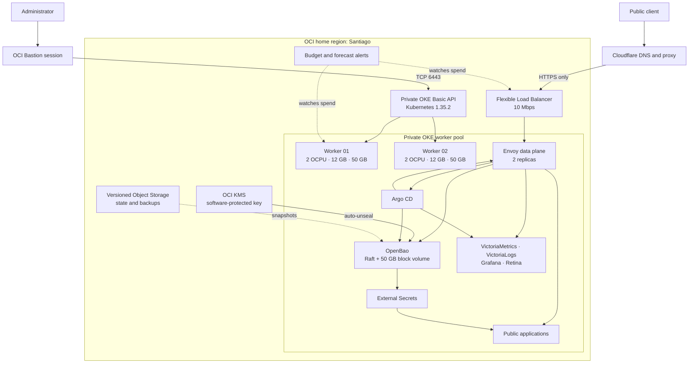
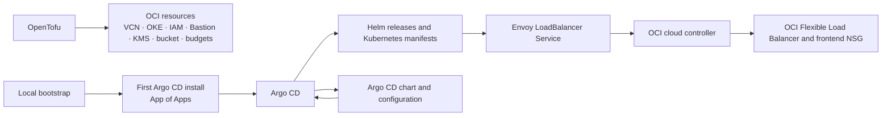
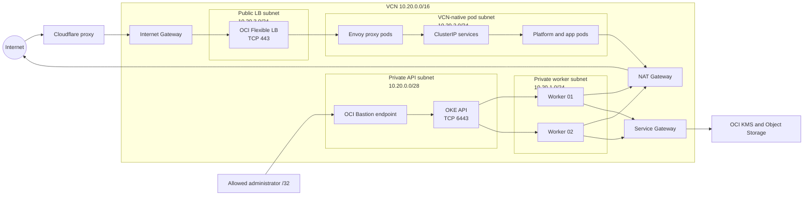
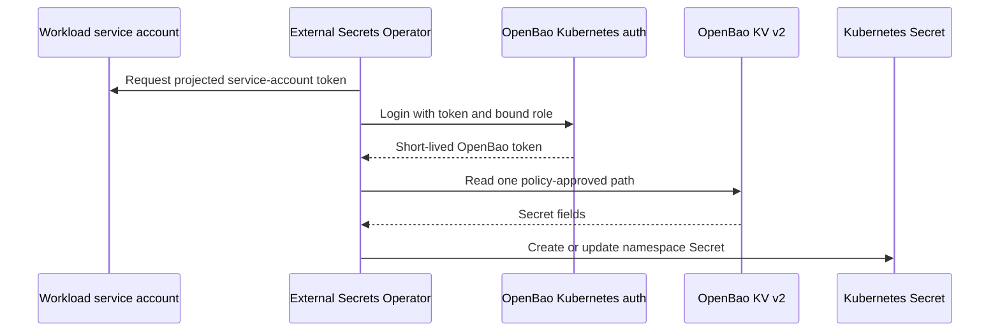
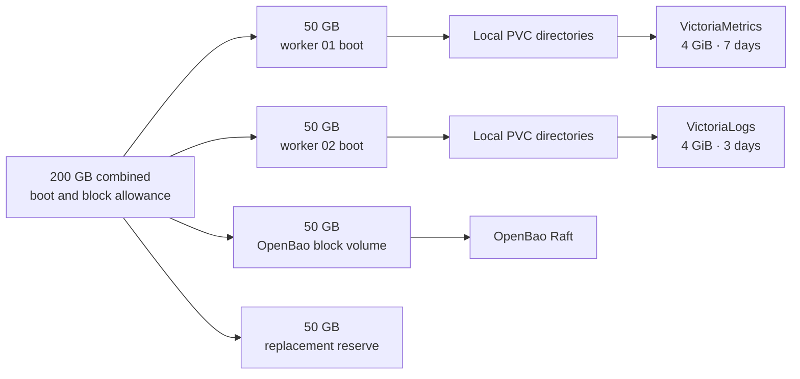

# $0 Kubernetes lab on Oracle Cloud

This repository builds and operates a private, two-node Oracle Kubernetes Engine cluster with OpenTofu and Argo CD. It uses production controls—private networking, GitOps, workload isolation, automatic TLS, centralized secrets, monitoring and cost alerts—inside OCI's paid-tenancy free allowances.

The target is a **$0 OCI bill**. A domain is the only required paid item.

> [!WARNING]
> Oracle reduced the documented Ampere A1 allowance for Always Free tenancies in June 2026. It is now 2 OCPUs and 12 GB of memory. Oracle's current [OCI price list](https://www.oracle.com/cloud/price-list/#pricing-compute) separately grants each paid tenancy 3,000 OCPU-hours and 18,000 GB-hours per month, which covers 4 OCPUs and 24 GB over a 720-hour month. This project uses a Pay As You Go tenancy. Cloud limits can change again, so check the current [Free Tier documentation](https://docs.oracle.com/en-us/iaas/Content/FreeTier/freetier_topic-Always_Free_Resources.htm), service limits, Terraform plan and cost forecast before you apply this configuration.

This is a permanent engineering lab, not a commercial production service. Two workers and no paid reserve limit capacity, maintenance options and fault tolerance.

## What this repository manages

- an OKE Basic cluster with a private Kubernetes API;
- two private `VM.Standard.A1.Flex` ARM64 workers;
- a VCN split into API, worker, pod and load-balancer subnets;
- short-lived administrative access through OCI Bastion;
- OCI IAM, a software-protected KMS key, a backup bucket and budget alerts;
- one 10 Mbps OCI Flexible Load Balancer created by Kubernetes;
- Argo CD and an App of Apps GitOps structure;
- Envoy Gateway, Gateway API, cert-manager and Cloudflare DNS;
- OpenBao with OCI KMS auto-unseal and External Secrets Operator;
- Calico in policy-only mode beside the OCI VCN-native CNI;
- VictoriaMetrics, VictoriaLogs, Grafana, Retina and node-level collectors;
- small public workloads deployed from immutable container-image digests.

## Architecture



### Ownership boundaries

Each controller owns one layer. The boundaries prevent OpenTofu, the OCI cloud controller and Argo CD from trying to manage the same object.



OpenTofu does not manage Helm releases. Argo CD does not manage the VCN, OKE, IAM or KMS resources. Kubernetes asks the OCI cloud controller to create the single public load balancer from the Envoy `Service`.

## Cost envelope

The OpenTofu root module contains checks for the planned capacity. A plan fails if the worker count, shape, compute, memory or disk allocation moves outside this layout.

| Resource | Configuration | Free basis | Guardrail |
| --- | --- | --- | --- |
| OKE control plane | Basic cluster | OKE Basic is listed as free | Cluster type fixed in code |
| Ampere A1 compute | 2 workers × 2 OCPU | 3,000 OCPU-hours for paid tenancies | Total must equal 4 OCPU |
| Memory | 2 workers × 12 GB | 18,000 GB-hours for paid tenancies | Total must equal 24 GB |
| Block storage | 150 GB provisioned | 200 GB combined boot and block storage | 50 GB kept unallocated |
| Public load balancer | Flexible, 10–10 Mbps | One Always Free Flexible Load Balancer | Min and max pinned to 10 Mbps |
| Object Storage | Private versioned bucket | Always Free Object Storage | Operational soft limit: 8 GB |
| KMS | Software-protected key | Software-protected master keys are free | Key use limited to worker principals |
| Bastion | Private endpoint, one-hour sessions | OCI Bastion free allowance | Exact API `/32` and TCP/6443 |
| Budgets | Actual and forecast rules | OCI budget service | Initial alert amount: 1 billing unit |

Budgets send alerts. They do not stop a paid resource. Always read the plan and check OCI Cost Analysis after a change.

## Network architecture

The Kubernetes API, workers and pods have private addresses. Only the load-balancer subnet accepts public traffic.



| CIDR | Purpose |
| --- | --- |
| `10.20.0.0/28` | Private OKE API and Bastion endpoint |
| `10.20.1.0/24` | Private worker nodes |
| `10.20.2.0/24` | VCN-native pod addresses |
| `10.20.3.0/24` | Kubernetes-managed public load balancer |
| `10.96.0.0/16` | Kubernetes Service addresses |

The load balancer accepts HTTPS only from Cloudflare's published IPv4 ranges. Envoy terminates the public certificate and routes by hostname with Gateway API. Administrative backends use a second, CA-verified TLS connection from Envoy to the service.

OCI provides pod addresses and routing. Calico runs in policy-only mode and enforces Kubernetes `NetworkPolicy`; it does not install a second CNI or change OCI's CNI configuration.

## GitOps applications

| Application | Version | Responsibility |
| --- | --- | --- |
| Argo CD | 3.4.5, chart 10.1.4 | App of Apps, reconciliation and self-management |
| Calico | 3.31.5, pinned commit | Policy-only network enforcement |
| Gateway API and Envoy Gateway | 1.8.3 | Gateway CRDs, controller and shared Envoy edge |
| cert-manager | 1.21.0 | Let's Encrypt DNS-01 and private service certificates |
| trust-manager | 0.24.0 | OpenBao CA distribution through public ConfigMaps |
| ExternalDNS | 0.21.0 | Cloudflare DNS records from accepted Gateway routes |
| OpenBao | 2.6.0, chart 0.28.5 | Central secrets, Kubernetes auth and OCI KMS auto-unseal |
| External Secrets Operator | 2.4.1 | Namespace-scoped delivery from OpenBao |
| VictoriaMetrics stack | chart 0.87.0 | Metrics, logs, Grafana, alert evaluation and exporters |
| VictoriaLogs Collector | chart 0.3.7 | Pod and node log collection |
| Retina | 1.2.3 | Pod, DNS and network telemetry |
| Local Path Provisioner | pinned commit | Small PVCs backed by worker boot disks |

Application directories are self-contained:

```text
gitops/applications/<name>/
├── application.yaml
├── values.yaml
└── manifest/
    └── Kubernetes resources not supplied by the chart
```

Sync waves install foundations before their consumers. Argo CD enables automated sync, self-healing and retry. Durable objects use `Prune=confirm` or `Delete=false` where an automated deletion would be unsafe.

## Secret flow

OpenBao runs one Raft server on a 50 GB OCI Block Volume. The worker instance principal calls OCI KMS to unseal it after a restart. The pod holds no OCI API key.



Each secret consumer receives:

- one OpenBao policy for an exact KV v2 path;
- one OpenBao Kubernetes role bound to a service account and namespace;
- one namespace-scoped `SecretStore` and `ExternalSecret`.

Cluster-wide secret stores, push APIs and wildcard read policies are disabled. The integration test verifies one allowed path and one denied neighboring path, then removes its temporary state.

## Storage model



| Data | Storage class | Node loss | Intended behavior |
| --- | --- | --- | --- |
| OpenBao Raft | `oci-bv-retain` | Volume reattaches to the other worker | Durable state; short service outage |
| VictoriaMetrics | `local-boot` | Local data can be lost | Seven-day disposable history |
| VictoriaLogs | `local-boot` | Local data can be lost | Three-day disposable history |
| Grafana | None | Pod restarts cleanly | Dashboards and data sources come from Git |

The OpenBao storage class uses the OCI CSI driver, `Retain` reclaim policy and `WaitForFirstConsumer`. Expansion is disabled because it could cross the disk allowance.

Local PVCs are directories on worker boot volumes. They survive a pod restart on the same worker. They do not provide replication or a backup. The two observability stores use anti-affinity so they do not share one worker.

## Security model

- The OKE API, workers and pods have no public IP addresses.
- Bastion sessions last at most one hour and can reach only the API on TCP/6443.
- OCI IAM and Kubernetes RBAC form separate authorization layers.
- Worker instance principals can use the OpenBao KMS key but cannot manage it.
- The OKE cluster principal can manage only the load-balancer frontend NSG needed for its `Service`.
- Cloudflare source ranges restrict traffic at the OCI load balancer.
- Namespace policies deny traffic by default and allow explicit service paths.
- Pods use non-root users, read-only root filesystems, dropped capabilities and `RuntimeDefault` seccomp where upstream images permit it.
- Argo CD, Grafana and OpenBao use Google OIDC with explicit local authorization.
- Public Git contains no credentials, state, kubeconfig, real OCIDs or backend settings.

## Repository layout

```text
.
├── infra/terraform/       OCI resources, checks and remote-state configuration
├── bootstrap/             First Argo CD install and OpenBao operator checkpoints
└── gitops/
    ├── bootstrap/         App of Apps
    └── applications/      One directory per Argo CD application
```

The OpenTofu stack uses one remote state object. The state bucket is created outside the stack so `tofu destroy` cannot delete its own state. The project compartment also has `prevent_destroy` enabled.

## Deployment sequence

### 1. Configure OpenTofu

Create ignored local configuration from the public examples:

```sh
cd infra/terraform
cp backend.hcl.example backend.hcl
cp terraform.tfvars.example terraform.tfvars
```

Fill the placeholders with values from your tenancy. Keep all OCIDs, profile names, home IPs and backend metadata out of Git.

### 2. Plan and apply OCI

```sh
tofu init -backend-config=backend.hcl
tofu fmt -check -recursive .
tofu validate
tofu plan -var-file=terraform.tfvars
tofu apply -var-file=terraform.tfvars
```

Read the plan before applying it. Confirm the planned capacity output is exactly 4 OCPUs, 24 GB of memory, 150 GB of provisioned disk and 50 GB of reserve.

### 3. Bootstrap Argo CD

Open a short-lived Bastion tunnel to the private API, select the generated Kubernetes context and run:

```sh
./bootstrap/gitops-bootstrap.sh
```

The script installs the pinned Argo CD chart only when the self-managed Argo CD `Application` does not exist. It then applies the App of Apps and waits for Argo CD to adopt itself.

### 4. Initialize OpenBao

OpenBao initialization is an explicit operator checkpoint. KMS can unseal an initialized server, but it cannot create its recovery material.

1. Run `bootstrap/openbao-prerequisites.sh` to place non-secret KMS identifiers in the namespace.
2. Initialize OpenBao and store all recovery keys and the initial root token offline.
3. Run `bootstrap/openbao-configure.sh` to create the administrator login, Kubernetes auth and the versioned KV store.
4. Test the administrator login.
5. Run `bootstrap/openbao-revoke-initial-root.sh` to revoke the initial root token.

Never store recovery keys or a root token in Git, Terraform state, a Kubernetes Secret or a shell-history entry.

### 5. Add external credentials

Create narrow Cloudflare tokens and OAuth clients outside Git. Store secret values in OpenBao. Commit only `ExternalSecret`, policy-bound identity and non-secret configuration.

## Operations and recovery

Before calling the platform complete, test these paths:

- both workers report `Ready`;
- Argo CD reports every application `Synced` and `Healthy`;
- OpenBao restarts, auto-unseals and accepts a CA-verified HTTPS request;
- External Secrets can read its assigned path and cannot read a neighboring path;
- cert-manager completes a Cloudflare DNS-01 staging challenge;
- Envoy routes each hostname through the one public load balancer;
- metrics, logs and Retina network series arrive in Grafana;
- OCI Cost Analysis and the forecast remain at zero.


## Known limits

- Two workers cannot form a three-member storage quorum.
- There is no free spare worker for surge upgrades.
- The public load balancer is limited to 10 Mbps.
- OpenBao has one replica and pauses briefly when Kubernetes moves it.
- Metrics and logs use node-local storage and can disappear with a worker.
- The cluster has no paid SLA or reserved capacity.

## Further reading

The accompanying article explains the decisions and failure modes in more detail: [A $0 Kubernetes lab on Oracle Cloud](https://israheck.com/blog/free-kubernetes-oracle-cloud/).
